<div align="center">

# Enterprise Multi-Tenant Intelligent Data Platform on AWS

### Deployment-ready enterprise data platform for Retail, Healthcare, Finance, and Logistics using AWS, Spark, Databricks, Snowflake, dbt, Airflow, Terraform, Kubernetes, and CI/CD.


</div>

---

## Project Overview

**Enterprise Multi-Tenant Intelligent Data Platform on AWS** is a deployment-ready reference implementation for a shared enterprise data platform.

It ingests, processes, governs, monitors, and serves data across **Retail, Healthcare, Finance, and Logistics** domains. The project is structured like an internal platform engineering repository, not a simple pipeline demo.

---

## Platform Capabilities

| Capability | Implementation |
|---|---|
| Multi-Domain Ingestion | Events, APIs, CSV uploads, CDC, databases, IoT telemetry |
| Streaming | Amazon Kinesis, Kafka-compatible consumers |
| Lakehouse | S3 Bronze, Silver, and Gold medallion layers |
| Processing | Spark, Databricks workflows, batch and streaming jobs |
| Warehouse | Snowflake business marts |
| Transformation | dbt models, tests, documentation, lineage YAML |
| Quality | Great Expectations checks for nulls, duplicates, freshness, schema drift |
| Orchestration | Airflow production-style DAGs |
| Deployment | Docker, Kubernetes, EKS, GitHub Actions |
| Governance | DataHub, OpenMetadata, PII tagging, ownership metadata |
| Observability | Prometheus, Grafana, CloudWatch, OpenSearch, SNS |
| Security | IAM least privilege, KMS, Secrets Manager, RBAC, audit logging |
| Cost Control | S3 lifecycle, autoscaling, spot nodes, Snowflake warehouse sizing |

---

## Architecture

```mermaid
flowchart LR
    Sources["Retail / Healthcare / Finance / Logistics Sources"] --> Ingestion["APIs + CDC + Events + IoT"]
    Ingestion --> Stream["Kinesis / Kafka Consumers"]
    Stream --> Bronze["S3 Bronze"]
    Bronze --> Spark["Spark + Databricks"]
    Spark --> Silver["S3 Silver"]
    Silver --> Gold["S3 Gold"]
    Gold --> Snowflake["Snowflake Warehouse"]
    Snowflake --> DBT["dbt Marts + Tests + Docs"]
    DBT --> BI["Executive, Finance, Sales, Supply Chain Analytics"]

    Airflow["Airflow Orchestration"] -. controls .-> Spark
    Quality["Great Expectations"] -. validates .-> Silver
    Governance["DataHub / OpenMetadata"] -. catalogs .-> DBT
    Monitoring["CloudWatch + Prometheus + Grafana"] -. monitors .-> Stream

    classDef source fill:#DBEAFE,stroke:#2563EB,color:#111827;
    classDef stream fill:#FCE7F3,stroke:#DB2777,color:#111827;
    classDef lake fill:#CCFBF1,stroke:#0D9488,color:#111827;
    classDef warehouse fill:#EDE9FE,stroke:#7C3AED,color:#111827;
    classDef quality fill:#DCFCE7,stroke:#16A34A,color:#111827;
    classDef monitor fill:#FEF3C7,stroke:#F59E0B,color:#111827;

    class Sources,Ingestion source;
    class Stream stream;
    class Bronze,Silver,Gold,Spark lake;
    class Snowflake,DBT,BI warehouse;
    class Airflow,Quality,Governance quality;
    class Monitoring monitor;
```



---

## Repository Map

```text
terraform/       AWS network, EKS, S3, Kinesis, ECR, Glue, CloudWatch, SNS, Secrets Manager
kubernetes/      Kustomize manifests for platform workloads and production controls
docker/          Images for API, Kafka consumer, dbt runner, and Spark runtime
airflow/         DAGs for streaming health, batch ingestion, CDC, dbt, and data quality
spark/           PySpark jobs for bronze, silver, and gold transformations
databricks/      Databricks workflows and notebook-style jobs
dbt/             Snowflake dbt project with facts, dimensions, marts, docs, and tests
snowflake/       SQL setup for warehouses, databases, roles, grants, stages, and tasks
quality/         Great Expectations configuration and expectation suites
monitoring/      Prometheus rules, Grafana dashboards, CloudWatch dashboard notes
metadata/        DataHub and OpenMetadata bootstrap assets
security/        IAM, RBAC, key policy examples, and threat model
docs/            Deployment guide, runbooks, governance, and cost optimization
```

---

## Quick Start

```bash
cp .env.example .env
cp terraform/environments/dev/terraform.tfvars.example terraform/environments/dev/terraform.tfvars

make terraform-init ENV=dev
make terraform-plan ENV=dev

make docker-build ENV=dev AWS_ACCOUNT_ID=<account-id>
make docker-push ENV=dev AWS_ACCOUNT_ID=<account-id>

aws eks update-kubeconfig --name enterprise-data-platform-dev --region us-east-1
make k8s-apply ENV=dev

make dbt-test
make smoke ENV=dev
```

---

## Business Domains

| Domain | Example Analytics |
|---|---|
| Retail | Sales performance, customer behavior, product trends |
| Healthcare | Patient operations, secure analytics, audit-friendly pipelines |
| Finance | Revenue reporting, payments, financial controls |
| Logistics | Shipments, supply chain performance, delivery monitoring |

---

## Why This Project Matters

This project demonstrates production-style data engineering skills across:

- Infrastructure as Code with Terraform
- Streaming ingestion with Kinesis and Kafka-style consumers
- Medallion lakehouse design on AWS S3
- Batch and streaming processing with Spark and Databricks
- Snowflake warehouse modeling with dbt
- Airflow orchestration
- Data quality with Great Expectations
- Governance with DataHub and OpenMetadata
- Monitoring with CloudWatch, Prometheus, and Grafana
- Secure multi-tenant platform deployment on EKS

---

## Author

**Sujoy Halder**  
AWS | Data Engineering | Spark | Databricks | Snowflake | dbt | Airflow | Terraform | Kubernetes

<div align="center">

### Built for enterprise-grade cloud data platform engineering


</div>
